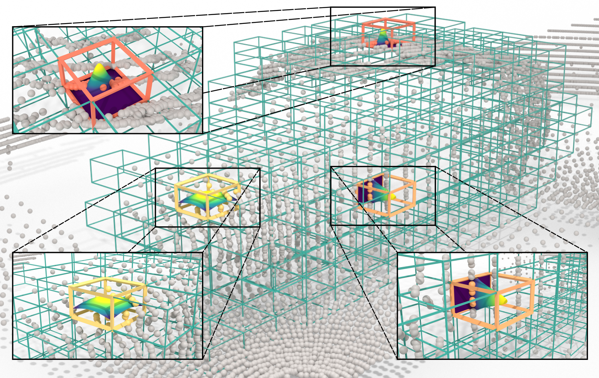

# [CVPR 2025] GBlobs: Explicit Local Structure via Gaussian Blobs for Improved Cross-Domain LiDAR-based 3D Object Detection

This repository features GBlobs, a parameter-free method designed to explicitly capture the local structure within point clouds. GBlobs lead to substantial improvements in domain generalization and cross-domain performance.

<div align="left">
    <a href="https://arxiv.org/abs/2503.08639" target="_blank">
        
    </a>
    <a href="https://huggingface.co/dmalic/GBlobs/tree/main" target="_blank">
        
    </a>
</div>

<details>
  <summary>Abstract</summary>
LiDAR-based 3D detectors need large datasets for training, yet they struggle to generalize to novel domains. Domain Generalization (DG) aims to mitigate this by training detectors that are invariant to such domain shifts. Current DG approaches exclusively rely on global geometric features (point cloud Cartesian coordinates) as input features. Over-reliance on these global geometric features can, however, cause 3D detectors to prioritize object location and absolute position, resulting in poor cross-domain performance. To mitigate this, we propose to exploit explicit local point cloud structure for DG, in particular by encoding point cloud neighborhoods with Gaussian blobs, GBlobs. Our proposed formulation is highly efficient and requires no additional parameters. Without any bells and whistles, simply by integrating GBlobs in existing detectors, we beat the current state-of-the-art in challenging single-source DG benchmarks by over 21 mAP (Waymo->KITTI), 13 mAP (KITTI->Waymo), and 12 mAP (nuScenes->KITTI), without sacrificing in-domain performance. Additionally, GBlobs demonstrate exceptional performance in multi-source DG, surpassing the current state-of-the-art by 17, 12, and 5 mAP on Waymo, KITTI, and ONCE, respectively.
</details>

<p align="center">
  
</p>

## Table of Contents
1. [Installation/Getting Started](#installation_getting_started)
2. [Obtaining the Checkpoints](#obtaining_checkpoints)
3. [Train and Evaluation](#train_eval)
   * [Single-source Domain Generalization](#single_source_dg)
   * [Multi-source Domain Generalization](#multi_source_dg)
5. [Citation](#citation)


## Installation/Getting Started <a name="installation_getting_started"/>

This project extends the [OpenPCDet](https://github.com/open-mmlab/OpenPCDet?tab=readme-ov-file) framework. To get started, you'll need to set up your environment and prepare the necessary datasets by following OpenPCDet's [installation instructions](docs/INSTALL.md) and [getting started guide](docs/GETTING_STARTED.md).

## Obtaining the Checkpoints <a name="obtaining_checkpoints"/>

You can easily access pre-trained checkpoints directly from [🤗 Hugging Face](https://huggingface.co/dmalic/GBlobs):
```bash
# Make sure git-lfs is installed (https://git-lfs.com)
git lfs install
git clone https://huggingface.co/dmalic/GBlobs ckpts
```
***Note***: Waymo Dataset License Agreement prevents us from sharing the models trained on Waymo.

## Training and Evaluation  <a name="train_eval"/>

To replicate the results from our paper, use the following commands:

### Training:
```bash
python train.py --cfg_file <path to config>
```

### Evaluation:
```bash
python test.py --cfg_file <path to config>  --ckpt <path to checkpoint>
```

For multi-GPU setups, convenience scripts are available:
- Single-node: [torch_train.sh](tools/scripts/torch_train.sh) and [torch_test.sh](tools/scripts/torch_test.sh)
- Multi-node: [slurm_train_v2.sh](tools/scripts/slurm_train_v2.sh) and [slurm_test_mgpu.sh](tools/scripts/slurm_test_mgpu.sh)

***Note***: While the Waymo Dataset License Agreement prevents us from sharing the pretrained models, you'll find that training with the default configurations yields similar results.

### Single-source Domain Generalization <a name="single_source_dg"/>

The results presented in Table 2 of the paper can be reproduced using the following:
| Task           | 3D AP Car/Ped/Cyc | Config                                                                                                                                         | Ckpt                                                                                                                                                                                                                         |
|----------------|-------------------|------------------------------------------------------------------------------------------------------------------------------------------------|------------------------------------------------------------------------------------------------------------------------------------------------------------------------------------------------------------------------------|
| Waymo→KITTI    | 78.75/65.98/58.72 | [`cfgs/waymo-kitti_models/voxel_rcnn_with_centerhead_gblobs.yaml`](tools/cfgs/waymo-kitti_models/voxel_rcnn_with_centerhead_gblobs.yaml)       | -                                                                                                                                                                                                                            |
| nuScenes→KITTI | 53.98/33.22/25.68 | [`cfgs/nuscenes-kitti_models/voxel_rcnn_with_centerhead_gblobs`](tools/cfgs/nuscenes-kitti_models/voxel_rcnn_with_centerhead_gblobs)           | [`../ckpts/nuscenes-kitti_models/voxel_rcnn_with_centerhead_gblobs/checkpoint_epoch_30.pth`](https://huggingface.co/dmalic/GBlobs/blob/main/nuscenes-kitti_models/voxel_rcnn_with_centerhead_gblobs/checkpoint_epoch_30.pth) |
| Waymo→nuScenes | 20.08/9.13/5.10   | [`cfgs/waymo-nuscenes_models/voxel_rcnn_with_centerhead_gblobs.yaml`](tools/cfgs/waymo-nuscenes_models/voxel_rcnn_with_centerhead_gblobs.yaml) | -                                                                                                                                                                                                                            |

KITTI→Waymo results from Table 3 of the paper can be reproduced with:
| Model       | 3D AP | Config                                                                                                                         | Ckpt                                                                                                                                                                                                         |
|-------------|-------|--------------------------------------------------------------------------------------------------------------------------------|--------------------------------------------------------------------------------------------------------------------------------------------------------------------------------------------------------------|
| PointPillar | 48.92 | [`cfgs/kitti-waymo_models/pointpillar_gblobs_3d-vfield.yaml`](tools/cfgs/kitti-waymo_models/pointpillar_gblobs_3d-vfield.yaml) | [`../ckpts/kitti-waymo_models/pointpillar_gblobs_3d-vfield/checkpoint_epoch_80.pth`](https://huggingface.co/dmalic/GBlobs/blob/main/kitti-waymo_models/pointpillar_gblobs_3d-vfield/checkpoint_epoch_80.pth) |
| SECOND      | 56.52 | [`cfgs/kitti-waymo_models/second_gblobs_3d-vfield.yaml`](tools/cfgs/kitti-waymo_models/second_gblobs_3d-vfield.yaml)           | [`../ckpts/kitti-waymo_models/second_gblobs_3d-vfield/checkpoint_epoch_80.pth`](https://huggingface.co/dmalic/GBlobs/blob/main/kitti-waymo_models/second_gblobs_3d-vfield/checkpoint_epoch_80.pth)           |
| Part-A^2    | 60.20 | [`cfgs/kitti-waymo_models/PartA2_gblobs_3d-vfiled.yaml`](cfgs/kitti-waymo_models/PartA2_gblobs_3d-vfiled.yaml)                 | [`../ckpts/kitti-waymo_models/PartA2_gblobs_3d-vfiled/checkpoint_epoch_80.pth`](https://huggingface.co/dmalic/GBlobs/blob/main/kitti-waymo_models/PartA2_gblobs_3d-vfiled/checkpoint_epoch_80.pth)           |

### Multi-source Domain Generalization <a name="multi_source_dg"/>
To reproduce the multi-source domain generalization results presented in Table 4 of the paper, use the following:
| Target*  | mAP   | Config                                                                                                           | Ckpt                                                                                                                                                                                     |
|----------|-------|------------------------------------------------------------------------------------------------------------------|------------------------------------------------------------------------------------------------------------------------------------------------------------------------------------------|
| KITTI    | 53.92 | [`cfgs/mdt3d_models/centerpoint_gblobs_kitti.yaml`](tools/cfgs/mdt3d_models/centerpoint_gblobs_kitti.yaml)       | -                                                                                                                                                                                        |
| ONCE     | 37.77 | [`cfgs/mdt3d_models/centerpoint_gblobs_nuscenes.yaml`](tools/cfgs/mdt3d_models/centerpoint_gblobs_nuscenes.yaml) | -                                                                                                                                                                                        |
| nuScenes | 8.15  | [`cfgs/mdt3d_models/centerpoint_gblobs_once.yaml`](tools/cfgs/mdt3d_models/centerpoint_gblobs_once.yaml)         | -                                                                                                                                                                                        |
| Waymo    | 23.81 | [`cfgs/mdt3d_models/centerpoint_gblobs_waymo.yaml`](tools/cfgs/mdt3d_models/centerpoint_gblobs_waymo.yaml)       | [`../ckpts/mdt3d_models/centerpoint_gblobs_waymo/checkpoint_epoch_30.pth`](https://huggingface.co/dmalic/GBlobs/blob/main/mdt3d_models/centerpoint_gblobs_waymo/checkpoint_epoch_30.pth) |

\* Target refers to the dataset that was excluded from the training and used solely for evaluating the model's performance

## Citation <a name="citation"/>

If you find our work useful, please consider citing us:

```bibtex
@inproceedings{cvpr2025gblobs,
  title={{GBlobs: Explicit Local Structure via Gaussian Blobs for Improved Cross-Domain LiDAR-based 3D Object Detection}},
  author={Du\v{s}an Mali\'c and Christian Fruhwirth-Reisinger and Samuel Schulter and Horst Possegger},
  booktitle={IEEE/CVF Conference on Computer Vision and Pattern Recognition},
  year={2025}
} 
```
